# CIS566 Final Project

Click below for the live demo!

[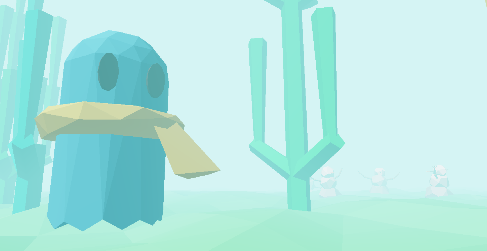](https://maukmu.github.io/procedural-final-project/)

- Quick start:
    - Controls:
      - WASD: Move forwards, left, backwards, and right. Like your usual first-person game.
      - Mouse:
        - You first need to enable mouse controls by clicking on the game screen. Your browser will then tell you something like "Press `ESC` to show your cursor" -- if you see this, mouse controls are enabled.
        - Move the mouse to look around. Like your usual first-person game.
        - Click the left button to interact with a few special objects in the world. You only need to interact with the ones that look most out of place.
    - There are **4** levels to see in total.

## Student Info

- Name: Mauricio Mutai
- PennKey: `mmutai`

## Design Document

### Introduction

- I would like to create a game similar to Yume Nikki (“Dream Diary” in Japanese), an indie RPG from 2004. Yume Nikki is a very unconventional RPG: it does not have a combat system, dialogue, or an obvious end goal (although it does have an “ending”). Instead, the appeal of Yume Nikki is in the large and interconnected worlds that the player can explore in the game. As the game’s title suggests, exploring these worlds is supposed to feel like dreaming.
- More importantly, although the worlds are fixed and the same in every playthrough, they still have a somewhat procedural feel to them. Based on this observation, I would like to create a similar “exploratory” game that focuses more on creating interesting environments the player can walk around, rather than following a more traditional game design strategy.

### Goal

- The end goal would be a game that allows the player to explore multiple worlds. In the vein of Yume Nikki, each world will have one general aesthetic theme (e.g. “snow”, “geometric”), but will be at least partially procedurally generated.
- Ideally, these worlds would be interconnected, such that the player could truly get “lost” in them (a common experience in Yume Nikki).

### Inspiration/reference

- Below are some images showing some of Yume Nikki’s worlds:

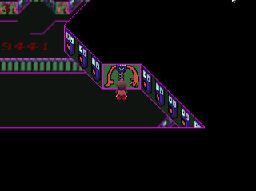

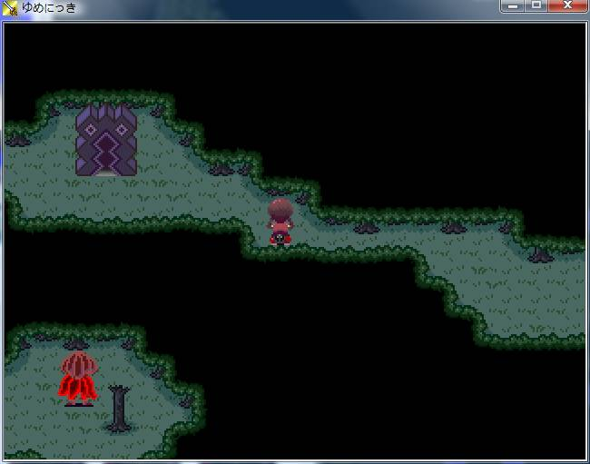

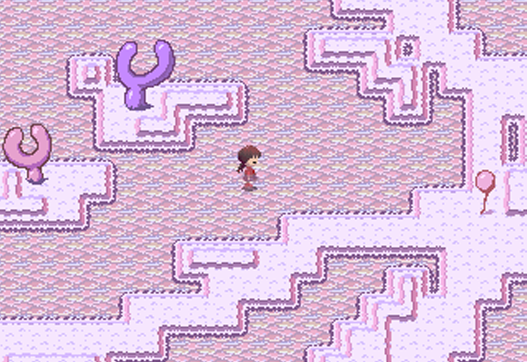

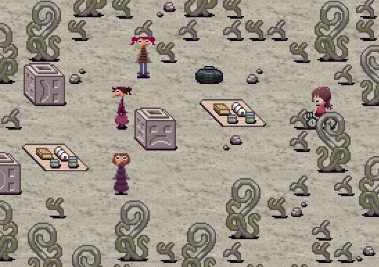

 
### Specification

- Main features:
  - At least 3 procedurally generated worlds that can be explored
    - Each world should be different across playthroughs, but generally feel similar (because they have a characteristic “aesthetic”)
    - See “Techniques” below
  - Keyboard and mouse controls
  - Real-time performance
  - JavaScript and WebGL
- Nice to have, not core features:
  - Minimalist soundtrack (like Yume Nikki’s)
    - As in, use royalty-free music from the Internet
  - Collectible items
    - The original Yume Nikki has several items that the player can collect. This can be added to make this project more “game-like”

### Techniques

- Some of the main procedural techniques I plan on using are:
  - Maze generation
  - “City” generation, or general procedural placement of assets
  - Terrain generation
- Other techniques I might use are:
  - Creature generation (although I expect complications with animating these)
  - Crowd simulation (at a very small scale)
  - L-systems
- The idea is to use one or two techniques per level, instead of using several techniques on all levels. This should help to make each level feel more unique.
- Adam has also mentioned I may not want to make the levels 100% procedurally, but rather use procedural techniques to generate the levels, then tweak them, since some “human intervention” can improve the level designs. Although I think this makes sense, I want to see how well “purely” procedural levels work before following this approach.
- Although I have not found any specific articles for reference, I think the lecture slides will be a good starting point. If necessary, I plan on looking up more detailed papers and such.

### Design

- Below is a diagram illustrating the general design of the program:

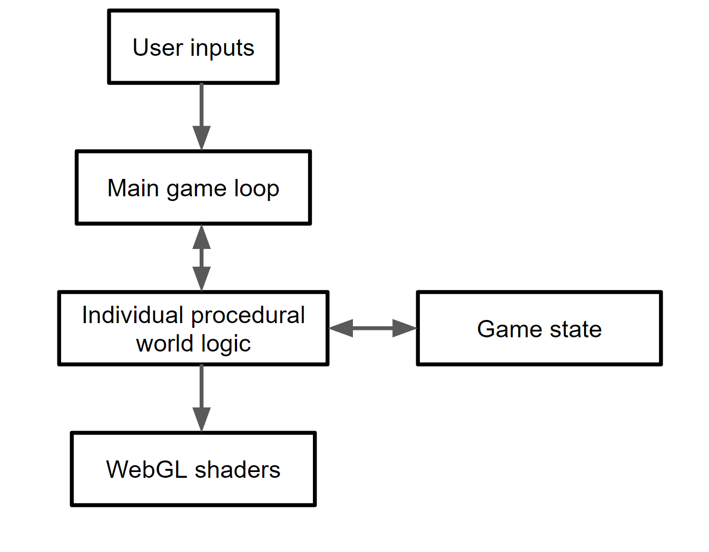

### Timeline

- 04/15: Basic game framework working (e.g. controls allow for basic movement), partial progress on first world.
- 04/22: Finish first and second worlds.
- 04/26: Finish third world and possibly more worlds or extra features like collectible items.

## Results

- I built four levels in total (with some "shared assets"). Below are screenshots of each of them.

### The Desert

### The Snowmen's Land

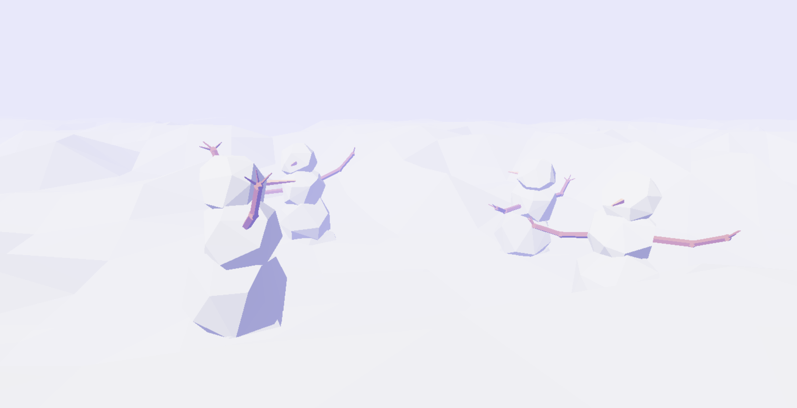

### The Nightmare

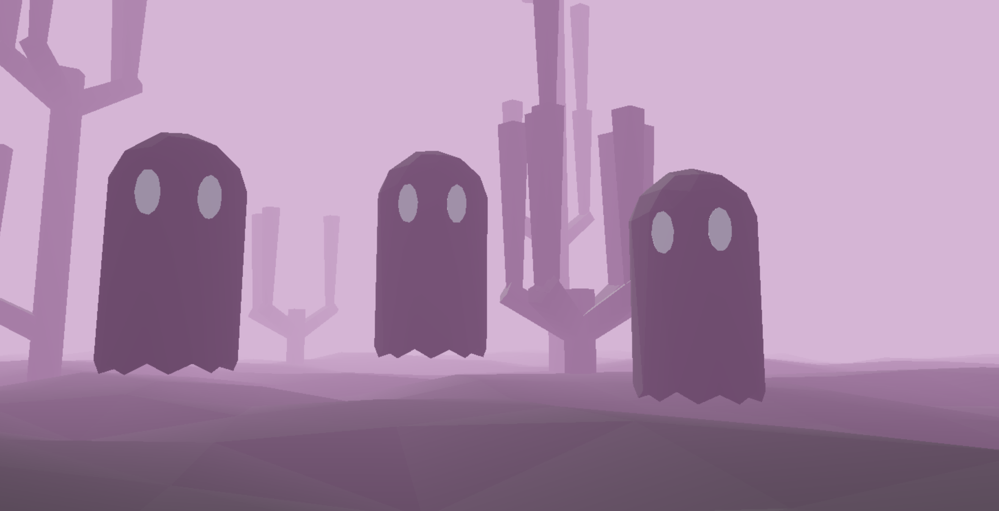

### The Dream

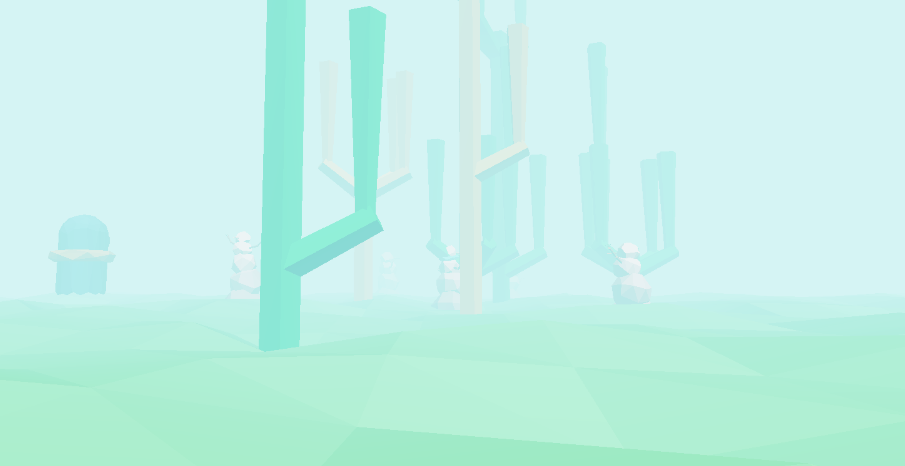

## Evalutation

### Overall Results

- I believe I got reasonably close to my original goals. I built a game that emulates some of Yume Nikki's key features, while also featuring several procedural techniques to make each playthrough slightly different and unpredictable.

- I do think the game could overall be more procedural. (See more below.)

### Aesthetics

- From the beginning, I knew I wanted a low-poly aeshtetic for my game.
  - I thought this would be a "safe" way of ensuring I could get real-time performance (at least on the GPU side).
  - Since Yume Nikki is a bit of a retro game, I thought a retro-esque style would fit with the spirit of the project.
  - I expected to create some models for this project. Given my limited experience with modeling, I thought the low-poly aesthetic would be more consistent with any models I ended up making.
    - I did make a few models in the end, using Blender's Decimate modifier to make them look extra low-poly.
  - I also just like low-poly models in general.

- Fog is very prevalent in this game.
  - The technical reason for this is that my terrain loops, and I use the fog to hide the terrain that would otherwise "pop in" as the player moves.
  - In Yume Nikki, you have a relatively limited view of the world around you. I think the fog helps in replicating this feeling in this game.
  - I think the fog gives the worlds a more dream-like appearance.

- Color had a big role in each level's design.
  - I spent a good amount of time thinking about how to color each asset in each level. Even the fog color is important, since it gets blended with any object that isn't right next to the player.
  - Here are some pictures from older versions of the code:
    - Coloring based on normal's coordinates
    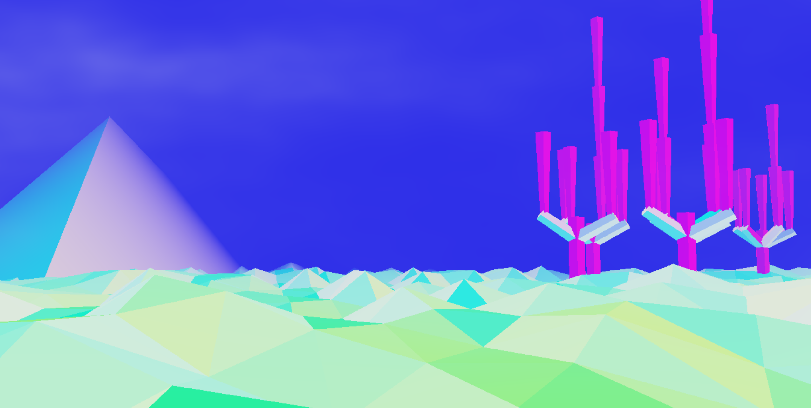
    - White terrain
    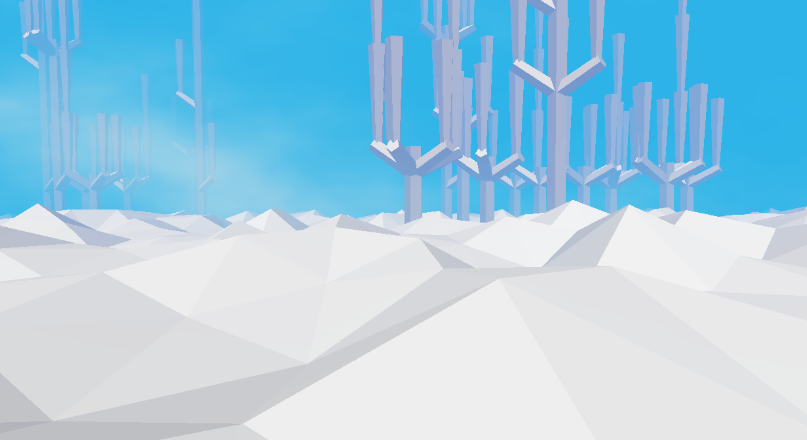

### Proceduralism

#### Terrain

- The terrain is generated by sampling a noise function. The samples are made smooth by sampling the noise at different frequencies and amplitudes (FBM).
- The height field is not just the direct result of this sample function. In each level, we can "process" the noise in order to achieve a certain type of terrain. For example, the snow level uses a Perlin gain function that maps the height field like so:
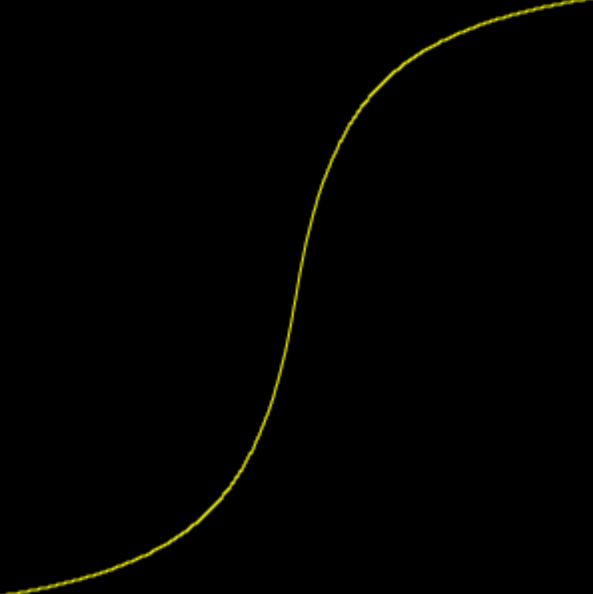
- This gives the snow level a flatter top than, say, the desert level, but still with some troughs.
- As mentioned above, the player loops over this procedural terrain if they walk too far. While it is certainly possible to generate an "infinite" amount of terrain (at least within our computers' physical limitations), I thought looped terrain would be better because:
  - In Yume Nikki, most levels also loop. This is actually a good decision if we consider how much emphasis Yume Nikki places on exploration -- it's already easy to get disoriented in some of Yume Nikki's larger levels, and if they extended infinitely, there would be very little sense of progress. Looping the level allows the player to walk by certain "landmarks" twice and realizing they're been there before.
  - This game has a few special objects the player can interact with. Although it is also possible to place copies of these objects on an infinitely expanding terrain, these objects are supposed to be unique.  If we placed only copy of each object (to respect the game's "lore") on infinite terrain, the player could potentially miss the object and never walk towards it. With looping terrain, the distance between the player and special objects is always bounded.
- Of course, looping terrain is not without its complications.
  - The height field at the edges of the terrain has to be somehow "stitched" together, i.e. modified so there are no discontinuities.
  - Collision detection is a bit more complicated than usual, since we have to essentially apply a modulo to the player's position on each frame. If we are not careful about **when** we apply the modulo, we may get horribly wrong results from the physics calculations.

#### Procedural Asset Generation

- There are two assets in this game that are generated using L-systems: the cacti and the snowmen. They each use relatively simple L-systems. This keeps their sizes relatively well-bounded so collision detection can be made simpler. This also prevents their designs from getting too busy.
- The cacti are made from prisms. The prisms' VBOs are all built within the program (i.e. no OBJs).
- The snowmen use prisms for their arms and hands. A "polysphere" (low-poly sphere) OBJ is used as the snowmen's heads and bodies. In addition, a "scarf" OBJ is occasionally added (a certain snowman always has a scarf).
- Other assets, such as the pyramid and the ghosts, don't really have anything significantly procedural about them. I tried giving the ghosts different eyes, but it just looked goofy.
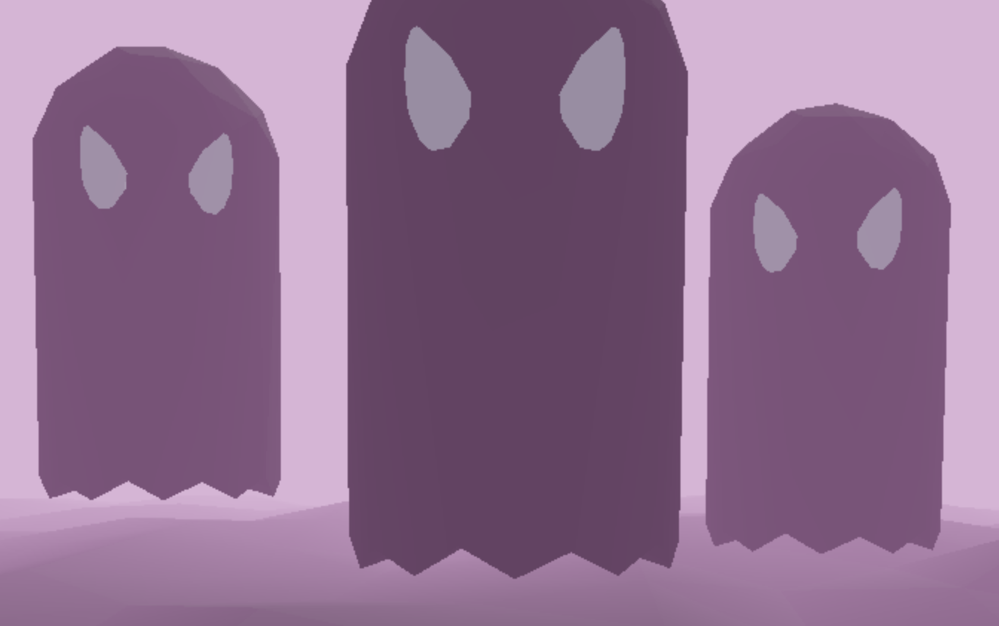
- I mentioned maze generation in my original design document. I think it would have been really cool to implement that, but it didn't happen due to time constraints.

#### Animation

- Unfortunately, animation is very limited in this game. Specifically, ghosts are the only animated entity in the game.
- "Nice" ghosts are relatively passive and just bounce in place.
- "Evil" ghosts chase the player, in addition to bouncing in place.
  - Essentially, in each tick, the ghosts move by a vector `P + A`, where `P` is the vector towards the player and `A` is the sum of vectors that move the ghost away from other ghosts.
  - `P` is scaled so that is larger when the ghosts are far away. Think rubberbanding in racing games.
  - `A` is used so the ghosts don't all bunch up into one (they are ghosts, so they *could* do it, but it doesn't look good).
  - Here is a picture from when ghosts didn't avoid each other (and were actually snowmen):
  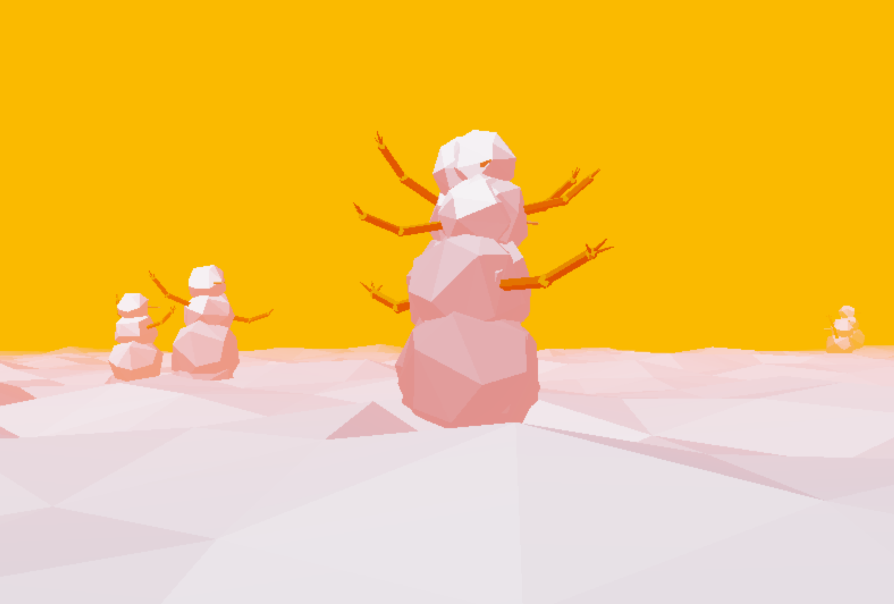

## Future Work

- Given more time, I would like to add:
  - Music. Music is extremely important in games, so I would have loved to add something to this, but I did not have enough time nor experience.
  - "Stronger" proceduralism. I think I played it a bit safe with the more procedural components. For example, I really wanted an L-system for creating statues (or even animatable meshes), but, due to time constraints, I decided to do simpler systems.
  - More objects for the user to interact with.
  - An "indoors" level, for variety. Yume Nikki, of course, does feature indoors levels (as well as levels that defy the definiton of indoors/outdoors).

## Acknowledgments

- [Perlin bias and gain](http://demofox.org/biasgain.html)
- [Blender, for letting me quickly model some OBJs](https://www.blender.org/)
- [I think I was subconsciously influenced by Undertale's Napstablook when making my ghosts](http://undertale.wikia.com/wiki/Napstablook)
- CIS566 staff, for teaching me so much about proceduralism.
  - In particular, Adam gave me a lot of helpful advice, since he is also familiar with Yume Nikki.
