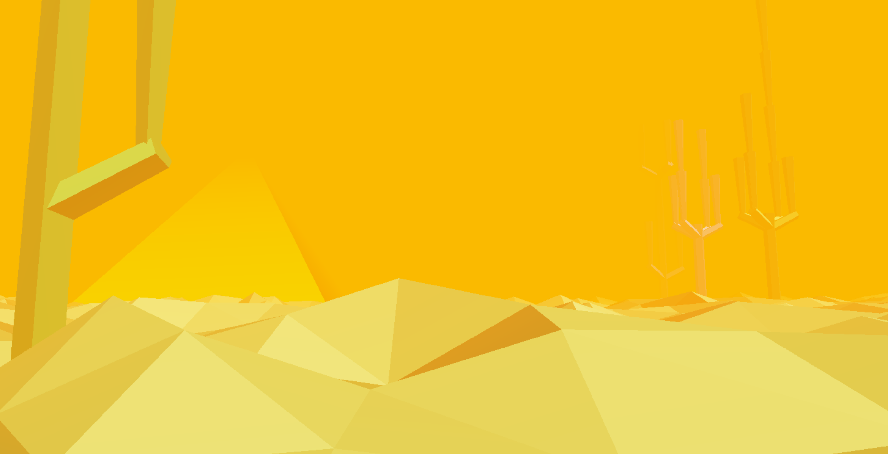

## CIS566 Final Project

Click below for the live demo!

- Quick start:
    - Controls:
      - WASD: Move forwards, left, backwards, and right. Like your usual first-person game.
      - Mouse:
        - You first need to enable mouse controls by clicking on the game screen. Your browser will then tell you something like "Press `ESC` to show your cursor" -- if you see this, mouse controls are enabled.
        - Move the mouse to look around. Like your usual first-person game.
        - Click the left button to interact with a few special objects in the world. You only need to interact with the ones that look most out of place.
    - There are **4** levels to see in total.

### Student Info

- Name: Mauricio Mutai
- PennKey: `mmutai`

### Design Document

#### Introduction

- I would like to create a game similar to Yume Nikki (“Dream Diary” in Japanese), an indie RPG from 2004. Yume Nikki is a very unconventional RPG: it does not have a combat system, dialogue, or an obvious end goal (although it does have an “ending”). Instead, the appeal of Yume Nikki is in the large and interconnected worlds that the player can explore in the game. As the game’s title suggests, exploring these worlds is supposed to feel like dreaming.
- More importantly, although the worlds are fixed and the same in every playthrough, they still have a somewhat procedural feel to them. Based on this observation, I would like to create a similar “exploratory” game that focuses more on creating interesting environments the player can walk around, rather than following a more traditional game design strategy.

#### Goal

- The end goal would be a game that allows the player to explore multiple worlds. In the vein of Yume Nikki, each world will have one general aesthetic theme (e.g. “snow”, “geometric”), but will be at least partially procedurally generated.
- Ideally, these worlds would be interconnected, such that the player could truly get “lost” in them (a common experience in Yume Nikki).

#### Inspiration/reference

- Below are some images showing some of Yume Nikki’s worlds:

 
#### Specification

- Main features:
  - At least 3 procedurally generated worlds that can be explored
    - Each world should be different across playthroughs, but generally feel similar (because they have a characteristic “aesthetic”)
    - See “Techniques” below
  - Keyboard and mouse controls
  - Real-time performance
  - JavaScript and WebGL
- Nice to have, not core features:
  - Minimalist soundtrack (like Yume Nikki’s)
    - As in, use royalty-free music from the Internet
  - Collectible items
    - The original Yume Nikki has several items that the player can collect. This can be added to make this project more “game-like”

#### Techniques

- Some of the main procedural techniques I plan on using are:
  - Maze generation
  - “City” generation, or general procedural placement of assets
  - Terrain generation
- Other techniques I might use are:
  - Creature generation (although I expect complications with animating these)
  - Crowd simulation (at a very small scale)
  - L-systems
- The idea is to use one or two techniques per level, instead of using several techniques on all levels. This should help to make each level feel more unique.
- Adam has also mentioned I may not want to make the levels 100% procedurally, but rather use procedural techniques to generate the levels, then tweak them, since some “human intervention” can improve the level designs. Although I think this makes sense, I want to see how well “purely” procedural levels work before following this approach.
- Although I have not found any specific articles for reference, I think the lecture slides will be a good starting point. If necessary, I plan on looking up more detailed papers and such.

#### Design

- Below is a diagram illustrating the general design of the program:

#### Timeline

- 04/15: Basic game framework working (e.g. controls allow for basic movement), partial progress on first world.
- 04/22: Finish first and second worlds.
- 04/26: Finish third world and possibly more worlds or extra features like collectible items.

### Results

- I built four levels in total (with some "shared assets"). Below are screenshots of each of them.

#### The Desert

#### The Snowmen's Land

#### The Nightmare

#### The Dream

