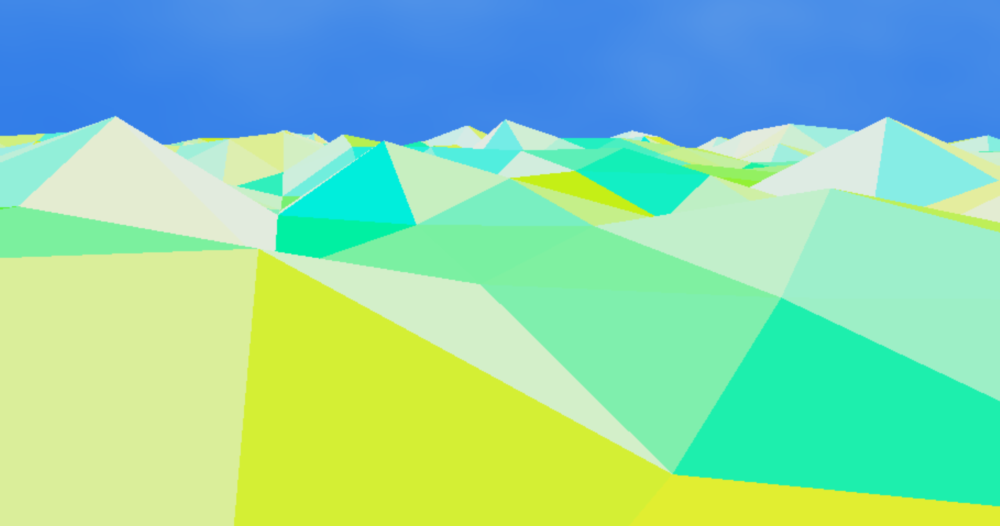

## Midpoint Milestone

I ended up writing a bit more than intended. The first three bullet points under "Mauricio" are probably what you're looking for, but feel free to read the other items as well. 

Make sure to check out the demo at the bottom (there are instructions for the controls right above the link). Right now, you can walk around **and** look around. Wow!

- Mauricio: 
  - I added code to procedurally generate low-poly terrain in `src/geometry/TerrainPlane.ts`. I used a 2D noise function from [Patricio Gonzalez Vivo](https://gist.github.com/patriciogonzalezvivo/670c22f3966e662d2f83). The terrain is colored based on the absolute value of its normal's coordinates.
  - I added a `Terrain` class in `src/game/Terrain.ts` to act as a collection of `TerrainPlanes` and integrate them into the game logic. It also "loops" the `TerrainPlanes` so the player can walk indefinitely on the same piece of terrain, similar to what Yume Nikki does.
  - I added a `Player` class in `sec/game/Player.ts`. This handles user inputs (WASD and mouse movement) to update the camera accordingly. It interacts with the `Terrain` class so the `Player` can "collide" with the procedural terrain.
  - I believe I have mostly met my goals for this milestone. I have a basic game framework working, and although I would have liked to have more progress on the first level by now, I at least have the basic terrain working, and have spent some time thinking about how to add features to the level to make it more unique (I just haven't implemented them).
    - In particular, I believe I can re-use the "put lots of geometry in one big VBO" method from my L-systems project to render several instances of decorations, such as trees, efficiently. I considered instanced rendering, but decided against this for two reasons:
      - Apparently, instanced rendering is only really helpful if you are drawing many instances (millions).
      - Rendering one instance of a tree, for example, could feel a bit repetitive. This can still be handled by specifying enough per-instance attributes to, for example, modify specific vertex positions before applying the instance's model matrix, but I felt this would be a bit cumbersome and still limiting compared to building an arbitrary VBO.
    - A really nice thing to have would be a simple L-system for generating slightly different decorations, instead of just having one decoration repeated all over.
    - I would also like to try tweaking the height field after it's been generated from noise in order to create geographical features, e.g. increase the heights in a certain circular region to create a mountain or mesa shape.
      - I am already doing this to a certain extent, since I have to "stitch" the height field at the edges of `TerrainPlanes` that are on the edges of the "loop rectangle" on which the player walks.
    - Although I would have liked to have more progress by now, I believe that once I have the tools for making one level (decoration generation, decoration placement, height field tweaks), making the other levels will be relatively quick.

- Controls:
  - WASD: Move the player as in a usual first-person game.
  - Mouse: Look at things (change the camera's orientation) as in a usual first-person game.
    - Due to JavaScript limitations, you have to click on the "canvas" (the game screen) to activate mouse controls.
    - Once you do this, your browser will tell you something like "Press `ESC` to show your cursor", which indicates mouse controls are enabled. Your cursor will also become invisible. 
    - If you press `ESC`, you will disable mouse controls and your cursor will become visible again.

- Click below for the demo!
